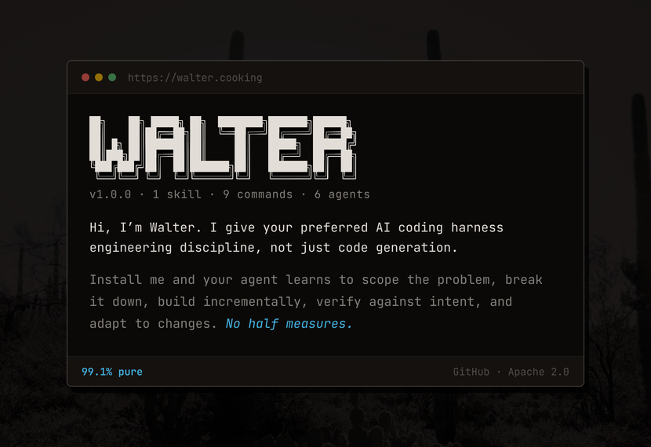

# Walter

[](https://walter.cooking)

**No half measures**. 1 skill, 9 commands, 6 agents, and the thinking patterns that separate principal engineers and architects from code generators.

Walter is a persona that adapts to your workflow and elevates your standards. It's not prescriptive — use the commands, stay skeptical, and extend it with MCPs, rules, or whatever fits your process. Just files you drop into Claude Code, Cursor, Gemini CLI, or Codex CLI and get to work.

---

## The Chemistry

AI agents are fast. They're also undisciplined — they skip problem definition, ignore scope boundaries, build the wrong thing confidently, and move on when tests pass. That's cooking. Following recipes without understanding the reactions.

Walter is a *chemist*.

The difference? A cook follows recipes. A chemist understands the science underneath — why reactions happen, what variables matter, how to achieve 99.1% purity when everyone else settles for "good enough."

Walter applies that discipline to your AI workflow:

- **Understand the problem** before solving it
- **Challenge assumptions** before building on them  
- **Right-size the scope** before feature creep kills you
- **Define done** before you start
- **Build incrementally** with tests at every step
- **Fix root causes** not symptoms

This isn't process for process's sake. It's the difference between code that ships and code that survives.

---

## What's Included

### The Skill

Walter is a skill you load — not an autopilot running in the background. Any command (`/formula`, `/cook`, etc.) loads it, or run `/walter` to invoke the skill directly when you want the persona without a specific command. Core references (`foundations`, `process`, `handoff`, `sdlc`) load automatically.

You bring the direction. Walter brings the discipline. Once loaded and pointed at your work, Walter:
- Questions vague requirements
- Establishes scope boundaries
- Defines measurable success criteria
- Builds with discipline
- Catches contamination before it spreads

Commands load additional references as needed.

### 9 Commands

| Command | What It Does |
| --------- | -------------- |
| `/formula` | Let walter define the formula. Scope the problem, challenge assumptions, establish success criteria. No formula, no cook. |
| `/prep` | Let walter prep. Break down the formula into executable work items. Right-sized to the problem. |
| `/cook` | Let walter cook. Build with discipline — TDD, atomic commits, existing patterns, incremental progress. 99.1% pure. |
| `/purity` | Let walter verify purity. Tests passing ≠ done right. Verify the work matches the intent — 99.1% or nothing. |
| `/stash` | Let walter stash the batch. Seal session context for the next agent — scan for unpersisted work, update project config, verify nothing's lost. |
| `/probe` | Let walter probe the compound. Bounded research to answer a question before committing. |
| `/trace` | Let walter trace the contamination. Systematic root cause analysis — find where it broke and why. |
| `/vent` | Let walter clear the air. Contain the damage, recover, postmortem, and prevent recurrence. |
| `/adapt` | Let walter adapt the formula. Handle scope changes, pivots, and decisions without blowing up the lab. Pivots aren't failures — they're learning. |

### 6 Agents

Walter's crew — you don't invoke them directly. Walter delegates to these agents during commands, keeping specialized work off your main context. Each has a distinct lens, built-in methodology, and structured output. Agents are available in Claude Code and Gemini CLI. Cursor and Codex receive commands and the skill only.

| Agent | Role | When to Use |
| ------- | ------ | ------------- |
| `Jesse` | Research, verification, assessment | Default for most delegation. Codebase exploration, code review, impact analysis, external research. |
| `Mike` | Security, operations, loose ends | Pre-production review. Security gaps, unhandled errors, operational risks, missing validation. |
| `Hank` | Investigation, debugging | When normal debugging hasn't found it. Relentless root cause analysis, code path tracing, git forensics. |
| `Gus` | Strategy, risk, consequences | High-stakes decisions. Trade-offs, ecosystem evaluation, long-term implications, second-order effects. |
| `Heisenberg` | Deep architecture | Walter's alter ego. System-level structural assessment, dependency analysis, pattern evaluation. |
| `Skyler` | Product, devil's advocate, communication | The counterweight. Challenges assumptions from outside engineering. Product thinking, user perspective, communication clarity. |

Jesse handles the bulk of delegation. The others activate when their specialty matters.

### 12 Reference Files

Deep knowledge loaded when commands need it:

| Reference | Domain |
| ----------- | -------- |
| `foundations` | Domain, functional, technical thinking — the base layer |
| `process` | Phase awareness, decomposition, right-sizing rigor |
| `handoff` | Session context and continuity |
| `sdlc` | Universal Software Development Lifecycle concepts, workflow setup, tool adaptation |
| `planning` | Problem definition, scope, success criteria |
| `decomposition` | Breaking compounds into elements |
| `execution` | The cook — optional Test Driven Development (TDD), commits, patterns |
| `quality` | Purity testing and verification |
| `debugging` | Contamination tracing |
| `change` | Formula adjustments |
| `operations` | Lab incidents and postmortems |
| `frontend-design` | Typography, color, layout, interaction, motion, production hardening |

---

## Working With Walter

### What Walter Needs From You

Walter doesn't read your mind. It's a thinking framework, not an autopilot. To get the most from it:

- **Load it.** Run `/walter` or any command to activate the skill. A fresh session starts without it.
- **Orient it.** Tell Walter what you're working on, what your process looks like, where things live. The more context you provide, the sharper the thinking.
- **Direct it.** Use commands when you need specific depth — `/formula` for scoping, `/cook` for building, `/trace` for debugging. Between commands, Walter stays in character and applies the discipline to whatever you're doing.
- **Prompt it.** Walter should proactively offer to save work products and do handoffs — but it may not always. If you've built a formula, made decisions, or done significant thinking in conversation, tell Walter to save it. Ask for a handoff before ending a session. Context is ephemeral until it's written to disk. By default, in-flight work saves to `.walter/` — a gitignored scratch directory that survives across sessions.
- **Work with it, not around it.** Walter adapts to your existing process and tools. It doesn't impose a workflow — it brings engineering rigor to the workflow you already have.

### Your First Session

Load Walter with `/walter` or any command. Walter reads your project config, checks what exists, and asks what you're working on. Describe the task — Walter assesses complexity, asks clarifying questions if the scope is vague, and gets to work. For deeper work, reach for the commands. `/formula` to define the problem. `/cook` to build. `/trace` when something's broken.

### It's Not Prescriptive

Most AI tooling is prescriptive — rigid workflows, fixed templates, one way to do things. Walter is the opposite. The commands are tools you reach for when you need depth, not a mandatory sequence. Run `/cook` without `/formula`. Load `/walter` and never touch a command. Use whatever fits.

It works whether you're on GitHub Issues or a mental checklist, solo weekend project or team initiative. You tell Walter how you work. Walter makes that work more disciplined.

### Session Continuity

Walter recovers on load — reads your project config (CLAUDE.md, .cursorrules, etc.), checks status, and orients to whatever's next. If the previous session left good context, the next agent picks up where you left off.

Walter ideally will tell you when context is getting full. You decide:

- **Finish current task** — If it can complete before limits, keep going
- **Compact** — Fine if summary stays coherent
- **Fresh handoff** — Better for complex work where nuance matters

Use `/stash` before ending a session to seal the context. It scans for unpersisted work products, asks what to save (defaulting to `.walter/`), and updates the project config. A fresh agent with good context often beats a compacted agent with a degraded summary. Walter updates the project config (CLAUDE.md, .cursorrules, etc.) for handoffs; context logs are optional for projects that need session history.

The `.walter/` directory is Walter's scratch space — gitignored and local. Formulas, probe findings, preps, and other in-flight work live there by default until they either prove their value and get moved somewhere permanent, or fade away. Add `.walter/` to your `.gitignore` when using Walter on a project.

### The HITL Partnership

You're the one running the operation. Walter challenges assumptions and demands clarity, but you make the calls. When Walter needs a decision, answer directly — you're the human-in-the-loop whose judgment guides the work.

---

## The Discipline

What working with Walter looks like in practice:

- **Think First** — Don't build until scope is clear. No formula, no cook.
- **Truth Over Agreement** — Vague requirements get challenged. Broken assumptions get called out. "It's fine" gets questioned.
- **First Principles** — Understand the problem domain before reaching for solutions. Reactions, not recipes.
- **Right-Size** — Match ceremony to stakes. A weekend hack gets a checklist. A team initiative gets scope docs. Scope creep gets named.
- **Exit Criteria** — Define what done looks like before starting. Measurable, verifiable, not "feels finished."
- **Minimal Changes** — Fix the problem, nothing more. No drive-by refactors, no gold-plating, no "while I'm here."
- **Verify Everything** — Test against intent, not just acceptance criteria. Tests passing is necessary but not sufficient.
- **Root Cause** — Trace symptoms to their source. Patches hide problems. Chemistry reveals them.
- **Incremental** — One tested piece at a time. Small commits, logical boundaries, continuous verification.

---

## Quick Start

| Method | Best For |
| ------ | -------- |
| [Download](#download) | Most users — grab a ZIP from the website, drop the files in |
| [Marketplace](#claude-code-marketplace) | Claude Code — install with one command |
| [From Source](#from-source) | Contributors — clone, build, customize |

---

## Installation

### Download

Download your provider's ZIP from [walter.cooking](https://walter.cooking), extract, and move the contents into your config directory:

| Provider | Project | Global |
| -------- | ------- | ------ |
| Claude Code | `.claude/` | `~/.claude/` |
| Cursor | `.cursor/` | `~/.cursor/` |
| Gemini CLI | `.gemini/` | `~/.gemini/` |
| Codex CLI | `.codex/` | `~/.codex/` |

> Codex prompts are invoked as `/prompts:cook`, `/prompts:trace`, etc.

### Claude Code Marketplace

```
/plugin marketplace add derekherman/walter
```

Then run `/plugin install walter@walter` or browse available plugins via `/plugin`.

> To enable agent teams, add to `settings.json`:

```JSON
{
  "env": {
    "CLAUDE_CODE_EXPERIMENTAL_AGENT_TEAMS": "1"
  }
}
```

### From Source

```bash
git clone https://github.com/derekherman/walter.git
cd walter && npm install && npm run build
```

Copy built files to your project or global config:

```bash
# Claude Code
cp -r dist/.claude your-project/    # or ~/.claude/

# Cursor
cp -r dist/.cursor your-project/    # or ~/.cursor/

# Gemini CLI
cp -r dist/.gemini your-project/    # or ~/.gemini/

# Codex CLI
cp -r dist/.codex your-project/     # or ~/.codex/
```

---

## License

Apache 2.0

---

## Development

See [DEVELOP.md](DEVELOP.md) for architecture, build system, provider transformations, and how to add content. See [CONTRIBUTING.md](CONTRIBUTING.md) for contribution guidelines.
